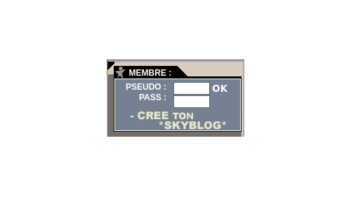
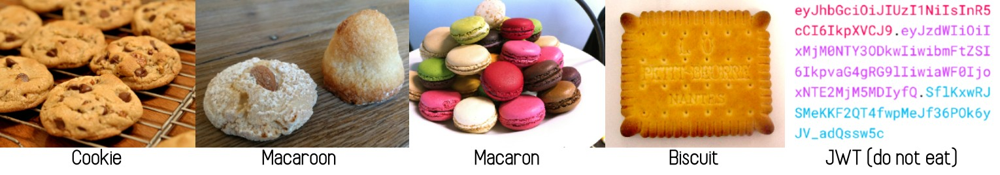

% Authentification / autorisation :<br>le cookie et ses rejetons
% Geoffroy Couprie &<br>Clément Delafargue
% DevFest Nantes 2022-10-21

---

## Let’s talk auth

---


<details role="note">
clementd
In practice many notions overlap, so it's not as clear cut as it might sound.
</details>

---

## Authn / Authz

<details role="note">
Geal
</details>

---

## I want to log in

<details role="note">
clementd
It usually starts there. I want to log in, in order to be able to do stuff…
</details>

---




<details role="note">
geal
… like typing linkin park lyrics on my skyblog
</details>

---

### Sending user and password

<details role="note">
clementd
a common way to log in is to provide a login and a password, so that
the server knows who we are
</details>

---


<details role="note">
clementd
here were're sending it in every request as query parameters. that can be improved,
but more on that later
</details>

---

# I want to log in with google. That's oauth, right?

<details role="note">
clementd
usually when we talk about logging in through an external provider, we think oauth
</details>

---

## oauth is about <del>authorization</del> delegation

<details role="note">
geal
oauth's goal is to provide access delegation so that a third-party app can access some resources.
It's not a mechanism designed to delegate authentication (even though authentication can be built
on top of it)
</details>

---


<details role="note">
geal
</details>

---

- OpenID
- OpenID Connect (OIDC)
- SCIM
- Self issued OpenID
- PassKeys
- …

<details role="note">
geal
OIDC (OpenID Connect) is a layer on top of oauth that provides authentication. Use it instead of
making your own solution. Such things are tricky to get right.
</details>

---

## I'm logged in, now what?

<details role="note">
clementd
logging in tells the server who you are (that's authentication), but now it has to decide what
you are allowed to do (that's authorization)
In any case, authentication (when it makes sense) is just the first step. We need to actually talk about authorization at some point
</details>

---

## Authorization rules

<details role="note">
clementd
the idea is to provide rules that can be used to decide wether or not requests are allowed to go through
</details>

---

## Terminology

<details role="note">
geal
what's a principal?
</details>

---

# Models

- ACLs
- RBAC
- ABAC

<details role="note">
todo geal
</details>

---

## Homegrown solutions

<details role="note">
clementd
That's what's done most of the time: ad hoc logic in controllers, sometimes more structured
by using a framework-specific solution
</details>

---

```
@Bean
public SecurityFilterChain securityFilterChain(HttpSecurity http)
  throws Exception {
   http
    .authorizeHttpRequests((requests) -> requests
      .antMatchers("/", "/home").permitAll()
      .anyRequest().authenticated()
    )
    .formLogin((form) -> form
      .loginPage("/login")
      .permitAll()
    )
    .logout((logout) -> logout.permitAll());
  return http.build();
}
```

<details role="note">
clementd
here it's an example with spring security. so it's not always a bunch of `if` blocks,
it can be nicer, but it's still usually tied to a specific framework
</details>

---

# Off the shelf solutions

- Zanzibar implementations
- oso
- OPA
- casbin

<details role="note">
geal
Zanzibar & copycats: work well (if you're google). Quite restrictive, both in terms of
architecture, and expressivity:
Zanzibar brings its own authorization model, you have to build on top of that
</details>

---

## State management, cookies and tokens

<details role="note">
clementd
so earlier we were sending user and password at every request. that's definitely not satisfying.
so let's talk about how to make things persistent, and how to propagate information between actors
</details>


---

## Sessions +<br> 🍪 cookie 🍪

<details role="note">
clementd
State stored on the server + a cookie to link requests to said state
</details>

---


<details role="note">
clementd
in this case sessions are stored directly on the file system (iirc it was handled like that in PHP,
maybe it still is)
</details>

---

# Yes,

- simple
- easy to revoke

<details role="note">
clementd
Easy setup (no crypto), revoking a session is easy (just delete a file)
</details>

---

# but

- hard to scale

<details role="note">
clementd
It all depends on the state of a single server. Scaling out is not possible
without a shared sessions DB.
sticky sessions help, but still data loss if a server crashes
</details>

---

## 🔏🍪 Signed cookie

<details role="note">
clementd
Instead of storing state on the server, it's directly part of the cookie.
It's signed to avoid tampering
</details>

---


<details role="note">
clementd
the cookie contains state, and a digital signature created by the server making sure the cookie contents
have been generated by the server
</details>

---

# Yes,

- easy to scale out (no state on the server)
- performant

<details role="note">
clementd
clients send the cookie on every request, there is no need to have central state any more. The servers
just need a way to trust the signature carried by the cookie (eg with a shared secret, the same on all
instances).
If the signature alg is a HMAC, verifying token signatures has a very low perf impact
</details>

---

# but

- size limitations
- no private session state
- harder to setup (depending on crypto algorithms)
- revocation is harder

<details role="note">
clementd
the session contents are now part of every request, so session size becomes an issue for perf.
Session state is now readable by the client
Setup is a bit harder (proper algorithms and side-channel-free implementations)
Deleting a session is harder (since there is no central state any more)
</details>

---

## JWT, PASETO

<details role="note">
clementd
Signed cookies originated in full-stack web frameworks, with ad-hoc implementations.  
The same mechanism can be used as a general-purpose API token. JWT are a common choice for  
that, they allow to sign a JSON payload with various algorithms. They have a number of  
shortcomings that make them very easy to misuse. PASETO has been developed as a safer alternative.  
</details>

---

# JWT pitfalls: 🦶🔫

- too permissive (weak algorithms)
- token carries the signature algorithm (`alg=none`)
- implicit APIs in libraries


<details role="note">
clementd
JWT supports a lot of signature algorithms, some of them have known vulnerabilities.
The other issue is that the token itself carries the signature algorithm as a header,
which makes forgery trivial (eg `alg=none` lets you create valid tokens with no signature).
Combined with poorly designed libraries, it also lets an attacker exploit alg confusion:
the service verifies the token with a public key, expecting the token to be signed with RSA,
but the attacker provides a token signed with a HMAC, using the public key as the secret.
</details>

---

## <small style="font-size: 2.5rem;">What do we put in this <br><span style="display: inline-block; text-align:left; width: 6em;">cookie</span> anyway?</small>

<details role="note">
clementd
here the cookie is just a way to transmit data. talk with hubert to learn more about cookies, but
it's a very effective way to provide session info for end users
</details>

---

## <small style="font-size: 2.5rem;">What do we put in this <br><span style="display: inline-block; text-align:left; width: 6em;">query param</span> anyway?</small>

<details role="note">
clementd
sometimes a cookie is not what we want, for instance shareable links with no required logins. in that case we need to
be careful about what the link allows to do, and maybe make it short-lived
</details>

---

## <small style="font-size: 2.5rem;">What do we put in this <br><span style="display: inline-block; text-align:left; width: 6em;">header</span> anyway?</small>

<details role="note">
clementd
For now we've been talking about regular websites, where cookies are the usual delivery mechanism.
Cookies are still the best delivery mechanism for services called by a browser, but for machine-to-machine
communication, we can use dedicated HTTP headers 
most of the criticism you'll hear about tokens like JWT is about using headers for session info, because it
encourages us to build unsecure alternatives to what cookies do by default (eg localStorage)
</details>

---

## Just authentication data

<details role="note">
geal
for simple architectures with a full-stack monolith, the user id is a common choice: we just want to persist
who's logged in, and the server uses that information on every request
</details>

---

## Self-contained authorization rules

<details role="note">
geal
in a service-oriented architecture with machine-to-machine calls, identity information alone is not enough:
the token has to carry a description of what it's allowed to do
</details>

---

## Beware of the SPOF

<details role="note">
clementd
even in a service-oriented architecture, it's possible to centralize all access rules in a dedicated service.
the issue is that it becomes a SPOF: if it fails, the whole architecture fails.
So the tradeoff is usually SPOF vs higher latency for rights changes
</details>

---

## SPOF or latency

<details role="note">
clementd
that's the main tradeoff when choosing between bearer tokens and session tokens. a common mistake is to use bearer
tokens and then reintroduce a SPOF on top of it (typically for revocation checks)
</details>

---

## Mitigations

<details role="note">
clementd
short TTLs on tokens + stateful refresh tokens (à la oauth)
make sure tokens can be identified (so that they can be revoked)
</details>

---

## Attenuation

<details role="note">
geal
Given an initial scope, we want to restrict it so that an actor can perform a limited set of operations
while staying within the initial scope
</details>

---

## _regular_ attenuation

<details role="note">
geal
All the attenuation logic is handled server-side, the token contains a reference to the initial scope  
and to the allowed subset of rights. Creating a token with attenuated rights requires talking to the  
token generation service
</details>

---

## eg: IAM roles

<details role="note">
clementd
In AWS, you can create roles that have access to a restricted set of operations on a restricted set of resources.
to create a role, you need to connect to the IAM service and you get short-lived credentials in exchange. The IAM
service itself stores information about the role.
That's convenient, but it requires talking to IAM everytime you want to craft a restriction. This can fail, this
takes time, etc.
</details>

---

## _offline_ attenuation

<details role="note">
geal
Existing credentials can be _attenuated_ by appending restrictions, without having to talk to the token  
generation service.
</details>

---

## Macaroons

<details role="note">
clementd
Macaroons provide offline attenuation, through the use of _caveats_. It even allows 3rd-party attenuation:  
the token holder has to provide a proof, from an external service, that the token can be used in a specific context
</details>

---

## Biscuits

<details role="note">
geal
created for the clever cloud platform, as an evolution over macaroons.
Good POCs with macaroons, but symmetric crypto was a blocker,
as well as unstructured caveats
</details>

---



<details role="note">
geal
</details>

---

## <small style="font-size: 2.5rem">Authorization across a service oriented architecture</small>

<details role="note">
clementd
many high-level auth frameworks are tied to / exist within a specific tech stack  
(eg spring security). The goal here is to provide something that works on multiple  
platforms, without having to re-implement everything from scratch, if possible  
including tooling (token generation & audit)
</details>

---

## Cross-language authorization logic

<details role="note">
geal
the first step is to provide a langage-independent way of describing authorization logic  
this is necessary for a polyglot architecture, but that also makes tooling easier to  
implement (eg to audit authorization policies in isolation)
</details>

---

## No ties to specific authorization patterns


<details role="note">
clementd
even though it's beneficial to have consistent auth patterns at the org level, it should not  
be dictated by tools (especially cutting edge tools where we want space to explore)
</details>

---

## Datalog for authorization logic

<details role="note">
geal
Easy to review in a cross-language setup (no language-specific implementation of rights management)  
Easy encoding of nesting / hierarchical roles  
Expressive, not tied to specific patterns and encodings
</details>

---

```
// fact
right("file.txt", "read");

// rule
can_read($file) <- right($file, "read");

// check
check if right("file.txt", "read");

// policy
allow if right("file.txt", "read");
```

<details role="note">
geal
facts carry information needed to decide whether or not to allow a request to go through  
they are typically provided either by the authority (and carried in the token), or by the  
verifying party  
checks must all pass, and are useful for transverse checks (eg TTY checks, source IP restrictions, …)  
or restrictions (more on that later)  
policies are tried in order. The first one that matches decides if authorization was successful or not  
(no match -> deny)
</details>

---

```
// in the token
check if time($time), $time < 2022-10-21T00:00:00Z;
right("organization", "<org1_id>", "read");
right("organization", "<org2_id>", "write");
right("account", "<acct1_id>", "write");

// in the service
time(2022-10-20T00:00:00Z);
allow if right("organization", "<org1_id>", "write")
      or right("account", "<acct1_id>", "write");
```

<details role="note">
clementd
Here the token carries 1 check that must always be fulfilled (a TTL check)  
It also carries information about the holder: they're allowed to perform
read operation across the whole ORG1 organization, and write operation for ORG2.
They are also allowed to perform write operations on ACCT1 (accounts are part of orgs)
On the service side, the current time is provided (which will allow the token check to
pass), and a policy checks that the account being accessed can be edited by the holder
(either with direct account access, or through an organization).

Notice the `$time` bit, it's called a datalog variable and it is used for _unifying_
facts with rules.
</details>

---

## Offline attenuation

<details role="note">
geal
In biscuit it's twofold: first we need a cryptographic way to append content to an existing token,
making it impossible to remove while still making it possible to trust the wrapped token.
Secondly, we need a way to have the new content describe restrictions without being able to expand
the scope of the attenuated token
</details>

---

```
check if time($time), $time < 2022-10-20T00:00:00Z;
check if source_ip($source_ip), $source_ip == "1.2.3.4";
```

<details role="note">
clementd
checks must all pass, so they can only restrict a token, not expand it. They have access to the token
authority block and the verifier block, so they can use contextual information
</details>

---


<details role="note">
geal
</details>

---

# Third-party blocks

```
check if group("admin") trusting ed25519/<public_key>;


```

<details role="note">
clementd
third-party blocks allow gathering facts and checks from multiple sources, so you can restrict access
to specific resouces based on information coming from another company (eg give read-only access to
this dropbox file to my facebook friends), without requiring direct communication between dropbox
and facebook
</details>

---

# What's next?

- third-party blocks
- ECDSA support
- WebAuthn support
- More datalog features

<details role="note">
clementd &amp; geal
</details>

---

## In conclusion

<details role="note">
clementd &amp; geal

- many different tools
- most of them are either super complex or super rigid
- mostly identity and delegation
- ad-hoc solutions for actual authorization
- hard to audit code, often duplicated

</details>
