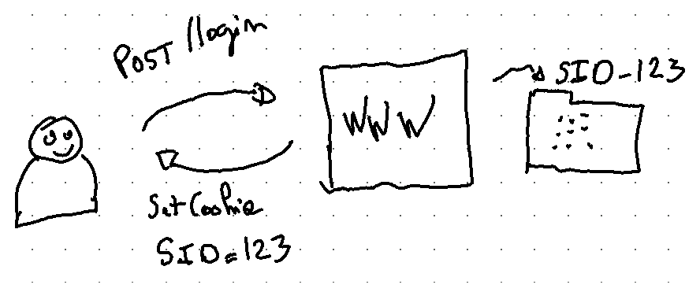

% Authentification / autorisation :<br>le cookie et ses rejetons
% Geoffroy Couprie &<br>Clément Delafargue
% DevFest Nantes 2022-10-21

---

## Let’s talk auth

<details role="note">
this is a note
</details>

---

## Authn / Authz

---

## I want to log in and stay connected

---

## Sessions +<br> 🍪 cookie 🍪

<details role="note">
State stored on the server + a cookie to link requests to said state
</details>

---



---

# Yes,

- simple
- easy to revoke

<details role="note">
Easy setup (no crypto), revoking a session is easy (just delete a file)
</details>

---

# but

- hard to scale

<details role="note">
It all depends on the state of a single server. Scaling out is not possible
without a shared sessions DB.
sticky sessions help, but still data loss if a server crashes
</details>

---

## 🔏🍪 Signed cookie

<details role="note">
Instead of storing state on the server, it's directly part of the cookie.
It's signed to avoid tampering
</details>

---


<details role="note">
the cookie contains state, and a digital signature created by the server making sure the cookie contents
have been generated by the server
</details>

---

# Yes,

- easy to scale out (no state on the server)
- performant

<details role="note">
clients send the cookie on every request, there is no need to have central state any more. The servers
just need a way to trust the signature carried by the cookie (eg with a shared secret, the same on all
instances).
If the signature alg is a HMAC, verifying token signatures has a very low perf impact
</details>

---

# but

- size limitations
- no private session state
- harder to setup (depending on crypto algorithms)
- revocation is harder

<details role="note">
the session contents are now part of every request, so session size becomes an issue for perf.
Session state is now readable by the client
Setup is a bit harder (proper algorithms and side-channel-free implementations)
Deleting a session is harder (since there is no central state any more)
</details>

---

## JWT, PASETO

<details role="note">
Signed cookies originated in full-stack web frameworks, with ad-hoc implementations.  
The same mechanism can be used as a general-purpose API token. JWT are a common choice for  
that, they allow to sign a JSON payload with various algorithms. They have a number of  
shortcomings that make them very easy to misuse. PASETO has been developed as a safer alternative.  
</details>

---

# JWT pitfalls: 🦶🔫

- too permissive (weak algorithms)
- token carries the signature algorithm (`alg=none`)
- implicit APIs in libraries


<details role="note">
JWT supports a lot of signature algorithms, some of them have known vulnerabilities.
The other issue is that the token itself carries the signature algorithm as a header,
which makes forgery trivial (eg `alg=none` lets you create valid tokens with no signature).
Combined with poorly designed libraries, it also lets an attacker exploit alg confusion:
the service verifies the token with a public key, expecting the token to be signed with RSA,
but the attacker provides a token signed with a HMAC, using the public key as the secret.
</details>

---

## What do we put in this cookie anyway?

---

## Just authentification data

<details role="note">
for simple architectures with a full-stack monolith, the user id is a common choice
</details>

---

## Self-contained authorization rules

<details role="note">
in a service-oriented architecture with API-to-API calls, identity information alone is not enough
</details>

---

## Authorization rules

<details role="note">
In any case, authentification (when it makes sense) is just the first step. We need to actually talk about authorization at some point
</details>

---

## RBAC / ABAC

<details role="note">
</details>

---

## Homegrown solutions

<details role="note">
</details>

---

## Off the shelf solutions

<details role="note">
Zanzibar & copycats: work well (if you're google). Quite restrictive, both in terms of
architecture, and expressivity
</details>

---

## I want to log in with google. That's oauth, right?

<details role="note">
</details>

---

## oauth is about authorization

---

## OIDC

---

## Authorization rules

<details role="note">
In the case of access delegation, fine-grained access control is even more important:
one rarely wants to delegate full control to a third-party tool
</details>

---

## Attenuation

<details role="note">
Given an initial scope, we want to restrict it so that an actor can perform a limited set of operations
while staying within the initial scope
</details>

---

## _regular_ attenuation

<details role="note">
All the attenuation logic is handled server-side, the token contains a reference to the initial scope  
and to the allowed subset of rights. Creating a token with attenuated rights requires talking to the  
token generation service
</details>

---

## eg: IAM roles

---

## _offline_ attenuation

<details role="note">
Existing credentials can be _attenuated_ by appending restrictions, without having to talk to the token  
generation service.
</details>

---

## Macaroons

<details role="note">
Macaroons provide offline attenuation, through the use of _caveats_. It even allows 3rd-party attenuation:  
the token holder has to provide a proof, from an external service, that the token can be used in a specific context
</details>

---

# Why biscuits?

- rights management over a polyglot architecture
- cross-language authorization logic
- no ties to specific authorization patterns
- offline attenuation
- asymmetric cryptography

---

## Rights management over a polyglot architecture

<details role="note">
many high-level auth frameworks are tied to / exist within a specific tech stack  
(eg spring security). The goal here is to provide something that works on multiple  
platforms, without having to re-implement everything from scratch, if possible  
including tooling (token generation & audit)
</details>

---

## Cross-language authorization logic

<details role="note">
the first step is to provide a langage-independent way of describing authorization logic  
this is necessary for a polyglot architecture, but that also makes tooling easier to  
implement (eg to audit authorization policies in isolation)
</details>

---

## No ties to specific authorization patterns


<details role="note">
even though it's beneficial to have consistent auth patterns at the org level, it should not  
be dictated by tools (especially cutting edge tools where we want space to explore)
</details>

---

## Datalog for authorization logic

<details role="note">
Easy to review in a cross-language setup (no language-specific implementation of rights management)  
Easy encoding of nesting / hierarchical roles  
Expressive, not tied to specific patterns and encodings
</details>

---

```
// fact
right("file.txt", "read");

// check
check if right("file.txt", "read");

// policy
allow if right("file.txt", "read");
```

<details role="note">
facts carry information needed to decide whether or not to allow a request to go through  
they are typically provided either by the authority (and carried in the token), or by the  
verifying party  
checks must all pass, and are useful for transverse checks (eg TTY checks, source IP restrictions, …)  
or restrictions (more on that later)  
policies are tried in order. The first one that matches decides if authorization was successful or not  
(no match -> deny)
</details>

---

```
// in the token
check if time($time), $time < 2022-10-21T00:00:00Z;
right("organization", "<org1_id>", "read");
right("organization", "<org2_id>", "write");
right("account", "<acct1_id>", "write");

// in the service
time(2022-10-20T00:00:00Z);
allow if right("organization", "<org1_id>", "write")
      or right("account", "<acct1_id>", "write");
```

<details role="note">
Here the token carries 1 check that must always be fulfilled (a TTL check)  
It also carries information about the holder: they're allowed to perform
read operation across the whole ORG1 organization, and write operation for ORG2.
They are also allowed to perform write operations on ACCT1 (accounts are part of orgs)
On the service side, the current time is provided (which will allow the token check to
pass), and a policy checks that the account being accessed can be edited by the holder
(either with direct account access, or through an organization).

Notice the `$time` bit, it's called a datalog variable and it is used for _unifying_
facts with rules.
</details>

---

## Offline attenuation

<details role="note">
In biscuit it's twofold: first we need a cryptographic way to append content to an existing token,
making it impossible to remove while still making it possible to trust the wrapped token.
Secondly, we need a way to have the new content describe restrictions without being able to expand
the scope of the attenuated token
</details>

---

```
check if time($time), $time < 2022-10-20T00:00:00Z;
check if source_ip($source_ip), $source_ip == "1.2.3.4";
```

<details role="note">
checks must all pass, so they can only restrict a token, not expand it. They have access to the token
authority block and the verifier block, so they can use contextual information
</details>

---

## Asymmetric cryptography

<details role="note">
Only the token emitter needs to know secrets, the rest of the services use public keys. this is capital
in a distributed architecture, to limit the blast radius of a service being compromised
</details>

---

- many different tools
- most of them are either super complex or super rigid
- mostly identity and delegation
- ad-hoc solutions for actual authorization
- hard to audit code, often duplicated

---

- biscuit is a platform
- particularly suited to distributed architectures
- datalog for rights management
- offline attenuation
